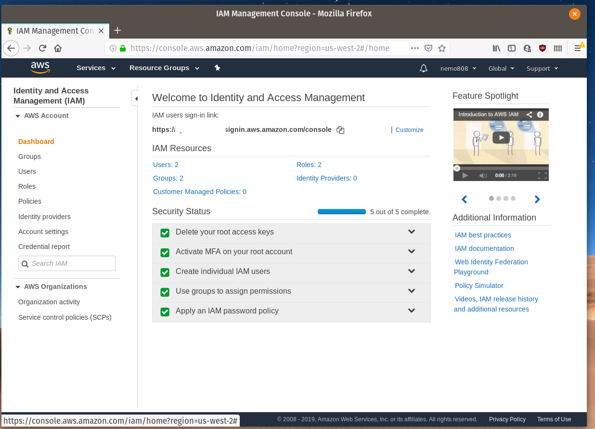
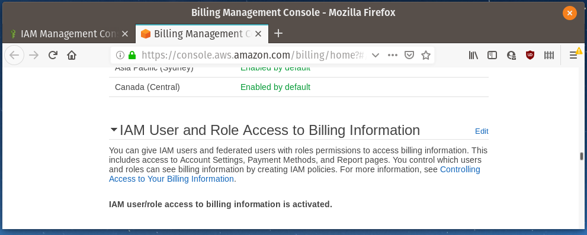
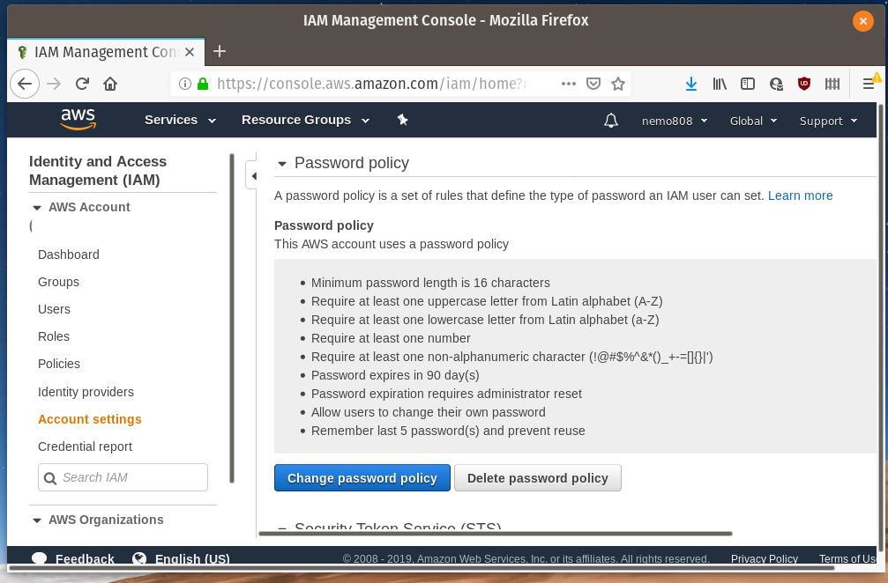
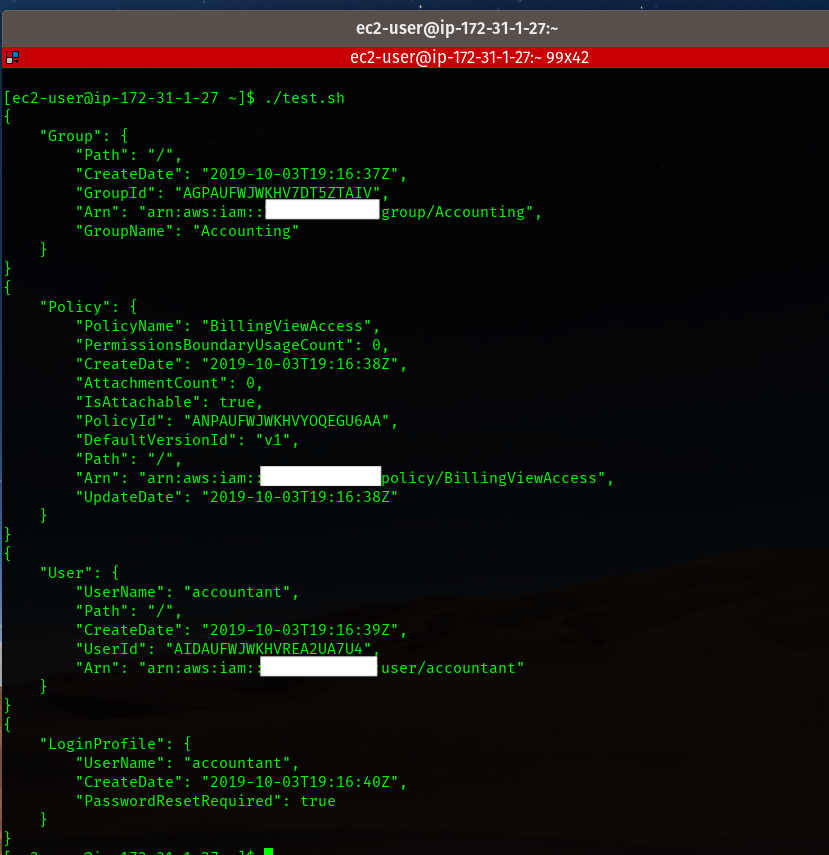
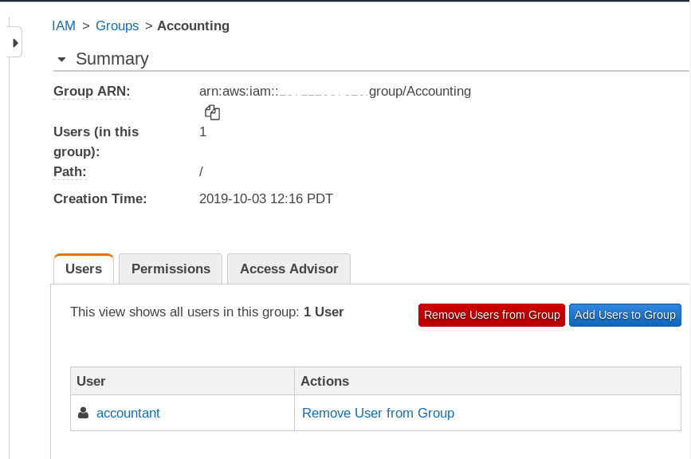
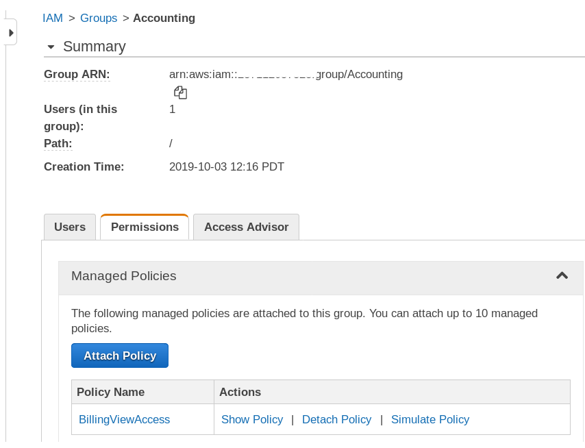

# IAM and S3 automation

## Management console tasks
- setup MFA
- setup password policy
- activated IAM access to billing
- deactivated STS endpoints in unused regions





## Code

#!/bin/bash

### Create Groups and attach AWS-managed policies
```
aws iam create-group --group-name SystemsAdministrator
aws iam attach-group-policy --policy-arn arn:aws:iam::aws:policy/job-function/SystemAdministrator --group-name SystemsAdministrator

aws iam create-group --group-name NetworkAdministrator
aws iam attach-group-policy --policy-arn arn:aws:iam::aws:policy/job-function/NetworkAdministrator --group-name NetworkAdministrator

aws iam create-group --group-name DatabaseAdministrator
aws iam attach-group-policy --policy-arn arn:aws:iam::aws:policy/job-function/DatabaseAdministrator --group-name DatabaseAdministrator

aws iam create-group --group-name Auditor
aws iam create-group --group-name Accounting
```

### Create IAM policies and attach to group

#### BillingViewAccess policy
```
aws iam create-policy --policy-name BillingViewAccess --policy-document file://billingview.json

aws iam attach-group-policy --policy-arn arn:aws:iam::000000000000:policy/BillingViewAccess --group-name Accounting
```

#### Billing Policy
Created BillingViewAccess IAM policy
[billing view access](billingview.json)

#### Force_MFA policy
Created Force_MFA IAM policy
[force MFA](force_mfa.json)

```
aws iam create-policy --policy-name Force_MFA --policy-document file://force_mfa.json

aws iam attach-group-policy --policy-arn arn:aws:iam::000000000000:policy/Force_MFA --group-name DatabaseAdministrator

aws iam attach-group-policy --policy-arn arn:aws:iam::000000000000:policy/Force_MFA --group-name NetworkAdministrator

## add Force_MFA to admin groups (except for sysad)
```

### Create Users and add to groups
```
aws iam create-user --user-name sysadmin1
aws iam create-login-profile --user-name sysadmin1 --password TEMP_PASSWORD_HERE --password-reset-required

# create-access-key creates the credentials for the users
# then appended to file "creds" which will be encrypted later

aws iam create-access-key --user-name sysadmin1 >> creds
aws iam add-user-to-group --user-name sysadmin1 --group-name SystemsAdministrator

aws iam create-user --user-name netadmin1
aws iam create-login-profile --user-name netadmin1 --password TEMP_PASSWORD_HERE --password-reset-required
aws iam create-access-key --user-name netadmin1 >> creds
aws iam add-user-to-group --user-name netadmin1 --group-name NetworkAdministrator

aws iam create-user --user-name dbadmin1
aws iam create-login-profile --user-name dbadmin1 --password TEMP_PASSWORD_HERE --password-reset-required
aws iam create-access-key --user-name dbadmin1 >> creds
aws iam add-user-to-group --user-name dbadmin1 --group-name DatabaseAdministrator

aws iam create-user --user-name accountant
aws iam create-login-profile --user-name accountant --password TEMP_PASSWORD_HERE --password-reset-required
aws iam add-user-to-group --user-name accountant --group-name Accounting

aws iam create-user --user-name auditor1
aws iam create-login-profile --user-name auditor1 --password TEMP_PASSWORD_HERE --password-reset-required
aws iam add-user-to-group --user-name auditor1 --group-name Auditor

aws iam create-user --user-name auditor2
aws iam create-login-profile --user-name auditor2 --password TEMP_PASSWORD_HERE --password-reset-required
aws iam add-user-to-group --user-name auditor2 --group-name Auditor
```
### Create S3 Buckets
```
# S3 cohort3-annual-reports
aws s3api create-bucket --bucket cohort3-annual-reports --region us-west-2 --create-bucket-configuration LocationConstraint=us-west-2
aws s3api put-bucket-encryption --bucket cohort3-annual-reports --server-side-encryption-configuration '{"Rules": [{"ApplyServerSideEncryptionByDefault": {"SSEAlgorithm": "AES256"}}]}'
aws s3api put-bucket-versioning --bucket cohort3-annual-reports --versioning-configuration Status=Enabled
aws s3api put-public-access-block --bucket cohort3-annual-reports --public-access-block-configuration "BlockPublicAcls=true,IgnorePublicAcls=true,BlockPublicPolicy=true,RestrictPublicBuckets=true"

# the logging command below did NOT work
#aws s3api put-bucket-logging --bucket cohort3-annual-reports --bucket-logging-status file://logging.json

# S3 cohort3-cloudtrail-logs
aws s3api create-bucket --bucket cohort3-cloudtrail-logs --region us-west-2 --create-bucket-configuration LocationConstraint=us-west-2
aws s3api put-bucket-encryption --bucket cohort3-cloudtrail-logs --server-side-encryption-configuration '{"Rules": [{"ApplyServerSideEncryptionByDefault": {"SSEAlgorithm": "AES256"}}]}'
```

### Attach bucket policies to S3
```
aws s3api put-bucket-policy --bucket cohort3-annual-reports --policy file://accounting_bucket.json

aws s3api put-bucket-policy --bucket cohort3-cloudtrail-logs --policy file://auditing_bucket.json
```
#### Bucket policies samples
[bucket policy for annual reports](accounting_bucket.json)

[bucket policy for cloudtrail logs](auditing_bucket.json)

### Encrypt Credentials
```
keybase encrypt alf808 -i creds -o creds.encrypted
rm creds
```

### Sample Run





